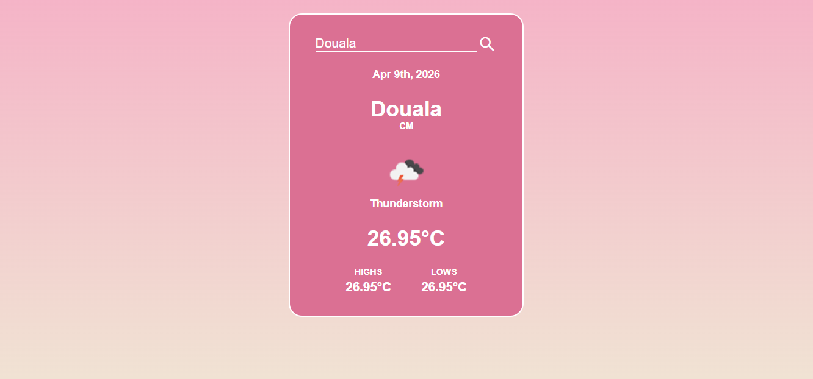

# Welcome to the Weather App!

Hello world! This is a fun little web app that lets you check the weather for any city around the world. I built it using the OpenWeatherMap API, and it's pretty easy to use with a cute pink theme (that's my favorite color by the way). The goal of this project is to get familiar with the Fetch API and with APIs in general.

## 📸 Preview

Check out how the project looks in action:

## What's Cool About It?

- You can search for weather by city name!
- The project shows current temperature, highs, lows, and a description.
- It displays weather icons from OpenWeatherMap.
- The UI is responsive, so it looks good on phones and computers.
- Mistakes are ahndled gracefully if you enter a wrong city!

## Technologies Used

- HTML5 for the structure
- CSS3 for the styling
- JavaScript for the interactivity (including event listeners, functions, asynchronous flow with async await and the fetch API).
- OpenWeatherMap API for the data

## How to Get Started

1. Clone or download this repo.
2. Open index.html in your web browser.
3. It starts with Yaounde (in Cameroon because that's my cityyyyyyyyy!!!), but you can search for any desired city.

## About the API Key

The app uses a free API key from OpenWeatherMap that was given to me when I created my account.  If you want your own:

1. Go to OpenWeatherMap, create an account and get a free key.
2. Update it in app.js (const APIkey = "enter you API key here").

## What's Inside?

- index.html - The main page
- style.css - The styles
- app.js - The JavaScript logic

## How It Works

1. You type a city name and click on the search icon.
2. JavaScript fetches data from the API.
3. It shows the weather on screen.
4. If the city isn't found, it lets the user know.

## Make It Yours!

Feel free to change colors, add features, or tweak anything. If you improve it, let me know!

Got questions? Open an issue or comment. Let's make this better together.

- Change default city in `app.js` (line with `weatherInfo("Yaoundé")`)
- Modify colors and styling in `style.css`
- Add more weather details by updating the API call and DOM updates